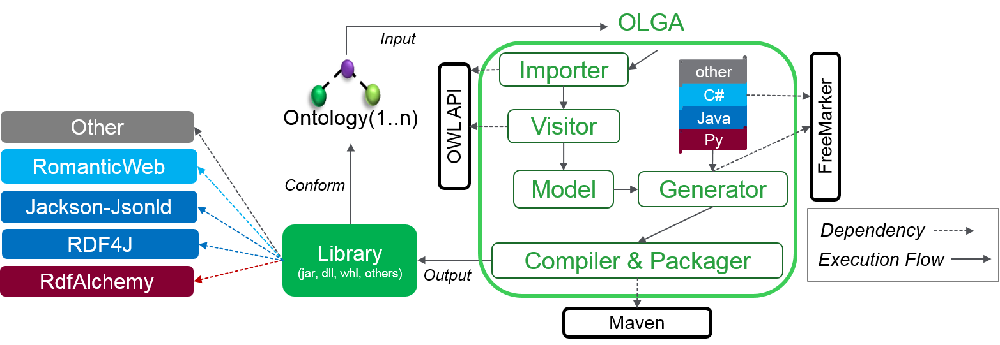

# OLGA: Ontology Library GenerAtor

OLGA is a generic tool aiming to accelerate the adoption of the Semantic technology such as the Ontology Web Language [OWL](https://www.w3.org/OWL) and the Resource Description Framework [RDF](https://www.w3.org/2001/sw/wiki/RDF), and Json Linked Data [Jsonld](https://json-ld.org/) in the Internet Of Things development.

OLGA complements existing OWL, RDF, and Jsonld serializers such as [Jackson-Jsonld in Java](https://github.com/io-informatics/jackson-jsonld) and [RDF4J](http://rdf4j.org/) or RDF Object Relational Mappers such as [RomanticWeb in C#](RomanticWeb.net) and [RDFAlchemy in Python](http://rdfalchemy.readthedocs.io/en/latest/index.html). 

OLGA takes as input the following:
1. One or more Ontologies
2. A paramter indicating the dependency of the generated library.
	1. Jackson-Jsonld - Java
	2. RomanticWeb - C#
	3. RDF4J - Java
	4. RDFAlchemy - Python

The output of OLGA is a generated library ready to be used by IoT developers. The generated library is conform to the ontology and is dependent on available serializers and ORMs in various languages (C#, Java, and Python for now) as shown below.
.

# SAREF Example
[SAREF](http://ontology.tno.nl/saref/) the Smart Appliances REFerence Ontology depends on the [Time](https://www.w3.org/TR/owl-time/) Ontology. Once merged the two ontologies have around 200 Classes and Individuals.

The following sections contain the generated code by OLGA of SAREF[.ttl](http://ontology.tno.nl/saref.ttl) and Time[.ttl](https://www.w3.org/2006/time) Ontologies. Each section provides the following:
1. Packaged generated library in .dll and .jar formats. (.whl is in progress).
2. Generated source code in C\# and Java. (Python in progress).
3. Generated ontology instance (A-Box) of an instantiation SAREF example.
4. An instantiation and usage examples for each of the generated SAREF libraries (Jackson-Jsonld and RomanticWeb). The examples demonstrate how any IoT developer can import the generated packages and use them in his development without any knowledge regarding ontologies. The provided examples show the instantiation of a [SAREF temperature sensor](http://ontology.tno.nl/saref/saref_TemperatureSensor.html) with a measurement temperature in degree Celsius, and other information such as the manufacturer and the model number.

# The sections of SAREF generated libraries 
1. [RomanticWeb-C#](/SAREF-RomanticWeb/README.md)
2. [Jackson-Jsonld-Java](/SAREF-Jackson-JsonLd/README.md)
3. [RDF4J-Java](/SAREF-RDF4J/README.md)
4. [RDFAlchemy-Python](/SAREF-RDFAlchemy/README.md)
	
