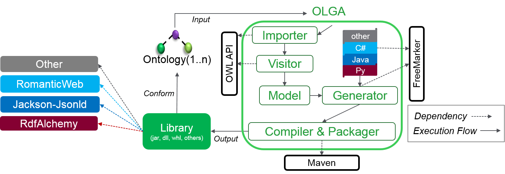

# OLGA: Ontology Library GenerAtor

OLGA is a generic tool aiming to accelerate the adoption of the Semantic Web technology such as the Ontology Web Language [OWL](https://www.w3.org/OWL) and the Resource Description Framework [RDF](https://www.w3.org/2001/sw/wiki/RDF), and Json Linked Data [Jsonld](https://json-ld.org/) in the Internet Of Things development.

OLGA complements existing OWL, RDF, and Jsonld] serialisers such as [Jackson-Jsonld in Java](https://github.com/io-informatics/jackson-jsonld) or RDF Object Relational Mappers such as [RomanticWeb in C#](RomanticWeb.net) and [RDFAlchemy in Python](http://rdfalchemy.readthedocs.io/en/latest/index.html). It takes one or more ontologies as an input and generates a library to be used by IoT developers. The generated a library is conform to the ontology and is dependent on available serialisers and ORMs in various languages (C#, Java, and Python for now) as shown below.
.

OLGA takes as input the following:
1. One or more Ontologies
2. A paramter indicating the dependency of the generated library.
	1. Jackson-Jsonld - Java
	2. RomanticWeb - C#
	3. RDFAlchemy - Python

# SAREF Example
[SAREF](http://ontology.tno.nl/saref/) the Smart Appliances REFerence Ontology dependes on the [Time](https://www.w3.org/TR/owl-time/) Ontology when merged they have around 200 Classes and Individuals.

The following sections contains the generated code by OLGA of the SAREF[.ttl](http://ontology.tno.nl/saref.ttl) and Time[.ttl](https://www.w3.org/2006/time) Ontologies. The generated libraries are dependent on the following:
1. [RomanticWeb-C#](/SAREF-RomanticWeb/README.md)
2. [Jackson-Jsonld-Java](/SAREF-Jackson-JsonLd/README.md)
2. [RDFAlchemy-Python](/SAREF-RDFAlchemy/README.md)
	
