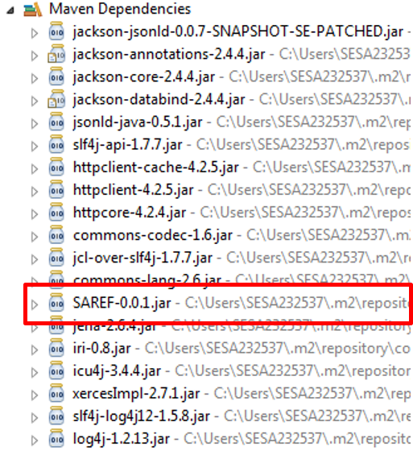

# SAREF-Jackson-JsonLd
SAREF Generated Library in Java with Jackson-JsonLd by OLGA 

# Jackson-JsonLd

[Jackson-JsonLd](https://github.com/io-informatics/jackson-jsonld) is a Java based serializer, it is an extension for Jackson. It is very easy to use. It relies on code decoration. Additional annotations has been proposed [here](https://github.com/charbull/jackson-jsonld).

# Example
In the [example](./example/) folder, a Java based maven solution is provided which relies on Jackson-JsonLd [saref-0.0.1.jar](./jar/) which is generated by OLGA, as shown in the figure below.



The generated code of the saref-0.0.1.jar can be found [here](./generatedCode/).

In the following a simple example is provided to depict the usage of the generated library (saref-0.0.1.jar) with the Jackson-JsonLd library.

## 1 Instantiate the Ontology Model
Saref-0.0.1.jar contains already the generated interfaces, classes with their annotations. Therefore, the instantiation can take place:

```Java
private static List create_SAREF_Instances()
{
 //TemperatureUnit
 ITemperatureUnit temperatureUnit = new TemperatureUnit("degree_Celsius");

 //Measurement
 IMeasurement indoorTemperature = new Measurement("1");
 indoorTemperature.addisMeasuredInOnly((IUnitOfMeasure) temperatureUnit);
 ((Measurement)indoorTemperature).hasValue = 32.5f;
 ((Measurement)indoorTemperature).hasTimestamp = Calendar.getInstance();
        
 //Temperature
 ITemperature temperature = new Temperature("2");
 ((IProperty)temperature).addrelatesToMeasurementOnly((Measurement)indoorTemperature);
        
 //Temperature Sensor
 ITemperatureSensor  temperatureSensor  = new TemperatureSensor("3");
 ((TemperatureSensor)temperatureSensor).hasManufacturer_String = "CompanyA";
 ((TemperatureSensor)temperatureSensor).hasModel_String = "M321";
 ((TemperatureSensor)temperatureSensor).hasDescription_String = "Low range Zigee temperature sensor";
 ((IDevice)temperatureSensor).addmakesMeasurementOnly((IMeasurement)indoorTemperature);
        
 List ontElements = new ArrayList();
 //Add the created instances to the list of ontology elements
 ontElements.add(indoorTemperature);
 ontElements.add(temperature);
 ontElements.add(temperatureSensor);
 
 return ontElements;
}
```

## 2 Create the Graph 
Once the ontology classes are instantiated, the graph can be generated, as shown below:
```Java
JsonldGraphBuilder builder =  JsonldGraph.Builder.create();
_sarefOntologyInstance = builder.build(listOfOntologyInstances);
```

## 3 Serialize
The output of the topology (ontology instances) can be serialized and saved in a jsonld file. The following, code snippet, serializes the content in an rdf file which can be found [here](./generatedOntologyInstance/).
```Java
 String saref = new File(".").getAbsolutePath() + "/src/main/resources/saref.json";
         
 File jsonLD_File = new File(saref);
 OutputStream outputStream = new FileOutputStream(jsonLD_File);
 JsonldModule jsonldModule = new JsonldModule();
 ObjectMapper objectMapper = new ObjectMapper();

 objectMapper.registerModule(jsonldModule);
 objectMapper.writer().writeValue(outputStream, _sarefOntologyInstance);
```


 

