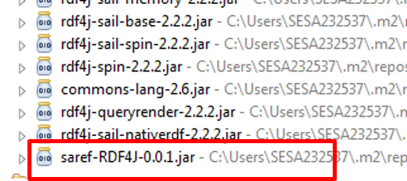

# SAREF-RDF4J

SAREF Generated Library in Java with RDF4J by OLGA 

# RDF4J

[RDF4](http://rdf4j.org/) is a Java based serializer. Its API is very low level and close to the RDF language.

# Example
In the [example](./example/) folder, a Java based maven solution is provided which relies on RDF4J [saref-0.0.1.jar](./jar/) which is generated by OLGA, as shown in the figure below.



The generated code of the saref-RDF4J-0.0.1.jar can be found [here](./generatedCode/).

In the following a simple example is provided to depict the usage of the generated library (saref-RDF4J-0.0.1.jar) with the RDF4J library.

## 1 Instantiate the Ontology Model
Saref-RDF4J-0.0.1.jar contains already the generated interfaces, classes with their annotations. Therefore, the instantiation can take place:

```Java
private static List create_SAREF_Instances()
{
 String ns = "http://w3id/saref/instance/example#";
		
 ITemperatureUnit temperatureUnit = new TemperatureUnit(ns, "degree_Celsius");
 IMeasurement indoorTemperature = new Measurement(ns, "2");
 indoorTemperature.addIsmeasuredin_Only((IUnitOfMeasure) temperatureUnit);
 ((Measurement)indoorTemperature).setHasvalue(32.5f);
 ((Measurement)indoorTemperature).setHastimestamp(new Date());
        
 ITemperature temperature = new Temperature(ns, "3");
 ((IProperty)temperature).addRelatestomeasurement_Only((Measurement)indoorTemperature);
        
 ITemperatureSensor  temperatureSensor  = new TemperatureSensor(ns, "4");
 ((TemperatureSensor)temperatureSensor).setHasmanufacturer_String("CompanyA");
 ((TemperatureSensor)temperatureSensor).setHasmodel_String("M321");
 ((TemperatureSensor)temperatureSensor).setHasdescription_String("Low range Zigee temperature sensor");
 ((IDevice)temperatureSensor).addMakesmeasurement_Only((IMeasurement)indoorTemperature);
}
```

## 2 Serialize
The output of the topology (ontology instances) can be serialized and saved in a jsonld file. The following, code snippet, serializes the content in an rdf file which can be found [here](./generatedOntologyInstance/).
```Java
 Rio.write(GLOBAL.model, System.out, RDFFormat.TURTLE);
```


 

