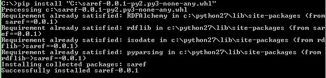
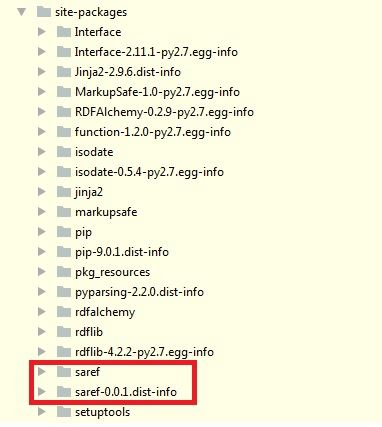

# SAREF in Python with RDFAchemy

SAREF Generated Library in Python with RDFAlchemy by OLGA 

# RDFAlchemy

[RDFAchemy](https://github.com/gjhiggins/RDFAlchemy) is a Python based serializer, it is an extension for RDFAlchemy. It is very easy to use. It relies on code decoration.

# Example

So first to install our saref you have to execute the following line :



In the [example](./example/) folder, a Python solution is provided which relies on RDFAlchemy [saref-0.0.1-py2.py3-none-any.whl](./package/) which is generated by OLGA, as shown in the figure below.



The generated code of the saref-0.0.1-py2.py3-none-any.whl can be found [here](./generatedCode/).

In the following a simple example is provided to depict the usage of the generated library (saref-0.0.1-py2.py3-none-any.whl) with the RDFAlchemy library.

## 1 Instantiate the Ontology Model

The .whl contains already the generated classes with their annotations. Therefore, the instantiation can take place:

```Python 
    SAREF = Namespace("http://www.saref.instance/example/")
    temperatureUnit = TemperatureUnit(URIRef(SAREF + "1"))

    indoorMeasurement = Measurement(URIRef(SAREF + "2"))
    indoorMeasurement.addisMeasuredInOnly(temperatureUnit)
    indoorMeasurement.hasValue = 32
    ts = time.time()
    indoorMeasurement.hasTimestamp = datetime.datetime.fromtimestamp(ts).strftime('%Y-%m-%d %H:%M:%S')

    temperature = Temperature(URIRef(SAREF + "3"))
    temperature.addrelatesToMeasurementOnly(indoorMeasurement)

    temperatureSensor = TemperatureSensor(URIRef(SAREF + "4"))
    temperatureSensor.hasManufacturer = "CompanyA"
    temperatureSensor.hasModel = "M321"
    temperatureSensor.hasDescription = "Low range Zigee temperature sensor"
    temperatureSensor.addmakesMeasurementOnly(indoorMeasurement)
```

## 2 Create a graph and Serialize

The output of the topology (ontology instances) can be serialized and saved in a .ttl file. The following, code snippet, serializes the content in an turtle file which can be found [here](./generatedOntologyInstance/).

```Python
	g = rdfSubject.db = Graph()
	#Instanciate
	g.serialize(destination='C:/output.ttl',format='turtle')
```

