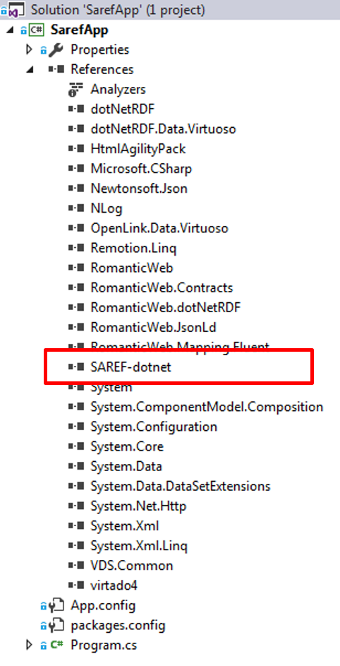

# RomanticWeb
SAREF Generated Library in C# with RomanticWeb by OLGA 

[RomanticWeb](http://romanticweb.net/) is an Object Mapping for RDF in .Net. It is easy to use and integrated with the [dotNetRDF](http://www.dotnetrdf.org/) library allowing it to connect to various persistent stores.

# Example
In the [example](./example/) folder, a dotNet solution is provided which relies on RomanticWeb and [Saref.dll](./dll/) which is generated by OLGA, as shown in the figure below.



The generated code of Saref.dll can be found [here](./generatedCode/).

In the following a simple example is provided to depict the usage of the generated library (Saref.dll) with the RomanticWeb library.

## 1 Prepare the Context Factory
Saref.dll contains already the generated interfaces with their annotations. Now, the classes can be instantiated through an entity context factory. But first, the context factory needed to be linked with the mappings from the assembly. 

The entity context is similar to the `ObjectContext` or `DbContext` from [EntityFramework](https://github.com/aspnet/EntityFramework6) or the `ISession` from [NHibernate](http://nhibernate.info/).

_RomanticWeb_ allows the _Fluent_ mode to instiate classes as well, as shown [here](http://romanticweb.net/docs/basic-usage/mapping/).

First, the declaration of the three following variables:
```C#
static IEntityContext context;
static ITripleStore store;
static string clientURI = "http://www.saref.instance/example";
```

Then, the contextFactory is configured to be linked with the mappings from the C# interfaces and their annotations.
```C#
public static void InitContext()
 {
  var contextFactory = new EntityContextFactory();
  contextFactory.WithMappings((MappingBuilder builder) =>
  {
   builder.FromAssemblyOf<ITemperatureSensor>();
  });

  store = new TripleStore();
  contextFactory.WithDotNetRDF(store);
  contextFactory.WithMetaGraphUri(new Uri(clientURI));
  context = contextFactory.CreateContext();
 }
```
In the previous code snippet, an in-memory triple store [dotNetRDF](http://www.dotnetrdf.org/) backend is used. It is also possible to configure the factory with an actual persistent store, such as Stardog.


## 2 Instantiate
Once the interfaces, annotations, and mappings in the context factory are all initialized, the ontology instantiating can take place. An indoorTemperature is created having a unit of measure degreeCelius. Then, a TemperatureSensor is instantiated and linked with the indoorTemperature, as shown below:
```C#
public static void Create_SAREF_Instances()
    {
        //Create the degreeCelius
        degree_Celsius degreeCelius = context.Create<degree_Celsius>(new Uri(clientURI+"#1"));
			
        //Indoor Temperature Measure
        IMeasurement indoorTemperature = context.Create<IMeasurement>(new Uri(clientURI + "#2"));
        indoorTemperature.AddIsmeasuredin_Only_UnitOfMeasure.Add(degreeCelius);
        indoorTemperature.Hasvalue = 32;
        indoorTemperature.Hastimestamp = DateTime.UtcNow;

        ITemperature temperature = context.Create<ITemperature>(new Uri(clientURI + "#3"));
        temperature.AddRelatestomeasurement_Only_Measurement.Add(indoorTemperature);
           
        //Temperature Sensor
        ITemperatureSensor temperatureSensor = context.Create<ITemperatureSensor>(new Uri(clientURI + "#4"));
        temperatureSensor.Hasmanufacturer = "CompanyA";
        temperatureSensor.Hasmodel = "M321";
        temperatureSensor.Hasdescription = "Low range Zigee temperature sensor";
        temperatureSensor.AddMakesmeasurement_Only_Measurement.Add(indoorTemperature);
           
        context.Commit();
    }
```
## 3 Store or Serialize
The output of the topology (ontology instances) can be serialized and saved in a file, in memory, or persistent in a store.
The following, code snippet, serializes the content in an rdf file which can be found [here](./generatedOntologyInstance/).
```C#
 static void Main(string[] args)
        {
            InitContext();
            CreateThingsTopology();

            IGraph g = new Graph();
            IList graphList = store.Graphs.ToList();

            foreach (IGraph currentGraph in graphList)
            {
                g.Merge(currentGraph);
            }

            RdfXmlWriter rdfxmlwriter = new RdfXmlWriter();
            rdfxmlwriter.Save(g, "C:\\output.rdf");
        }
```

## Next Steps
Other operations are possible such as querying through [LINQ](http://romanticweb.net/docs/basic-usage/linq/) or SPARQL.


 
